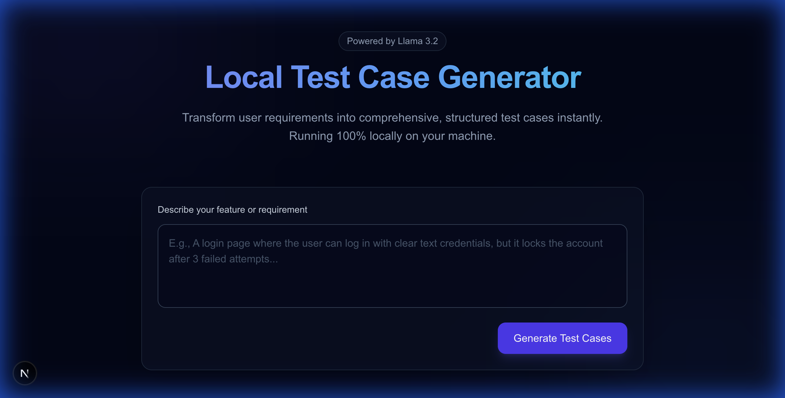

# 🚀 Local Test Case Generator (Llama 3.2)




A fast, offline-capable tool for generating comprehensive test cases from user requirements using Ollama (Llama 3.2) and Next.js.

## ✨ Features
- **Privacy First:** 100% Local execution. No data leaves your machine.
- **Premium UI:** Dark mode with smooth animations and responsive design.
- **Smart Generation:** Creates Functional, Edge Case, Security, and Performance scenarios.
- **Export Ready:** One-click export to `JSON` or `Markdown` for easy documentation.

## 🚀 How It Works
1. **Enter Requirements**: Type your feature description (e.g., "Login page with 2FA") into the input field.
2. **Generate**: Click "Generate Test Cases" and watch the AI create structured scenarios in real-time.
3. **Export**: Copy the results or download them as a file for your QA workflow.

## 🛠️ Prerequisites
1. **Ollama**: [Download Here](https://ollama.com/)
2. **Node.js (v18+)**: [Download Here](https://nodejs.org/)

## ⚡ Quick Start

### 1. Setup Ollama
Make sure Ollama is running and you have the Llama 3.2 model:
```bash
ollama pull llama3.2
ollama serve
```

### 2. Install Project
```bash
cd web-app
npm install
```

### 3. Run Application
```bash
npm run dev
```

Open [http://localhost:3000](http://localhost:3000) and start generating!

## 🔧 Troubleshooting
- **API Error:** Ensure Ollama is running on port `11434`.
- **Model not found:** Verify you ran `ollama pull llama3.2`.
